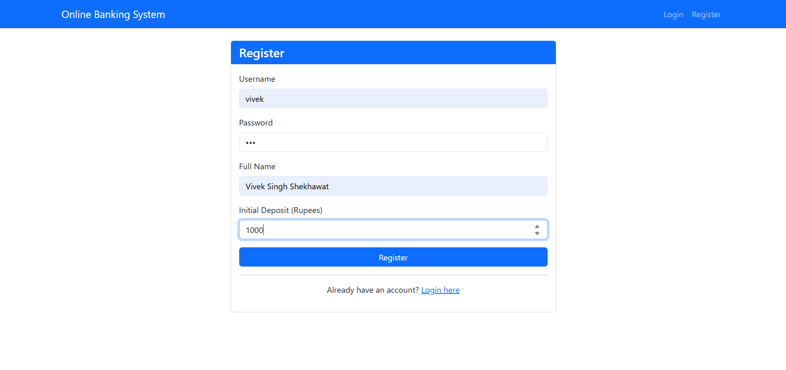
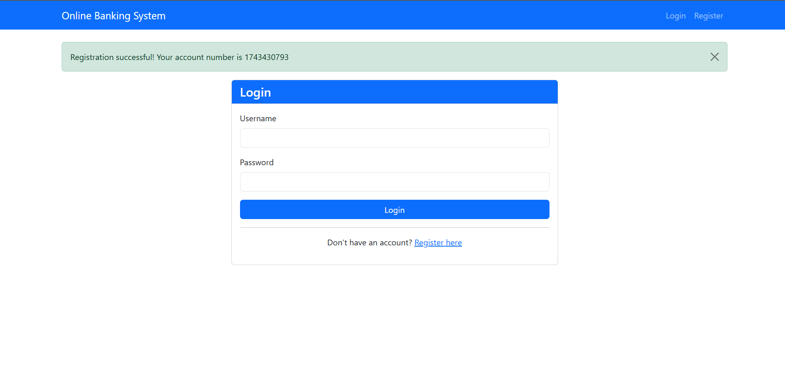
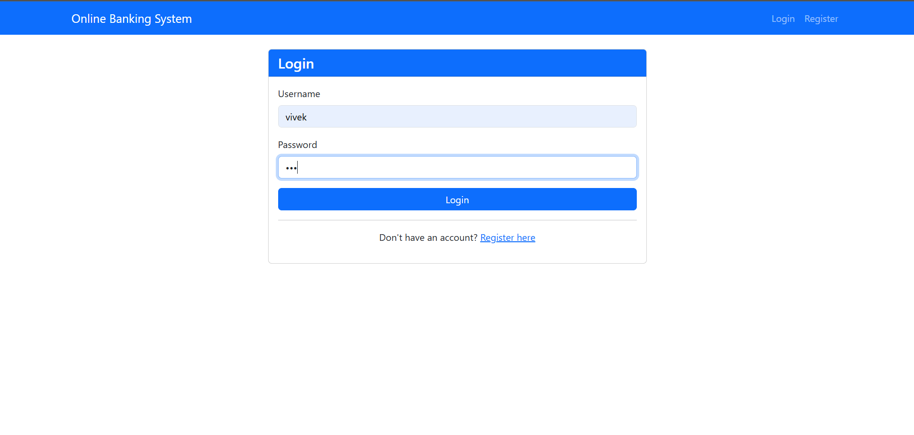
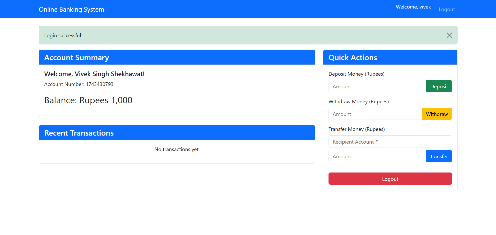
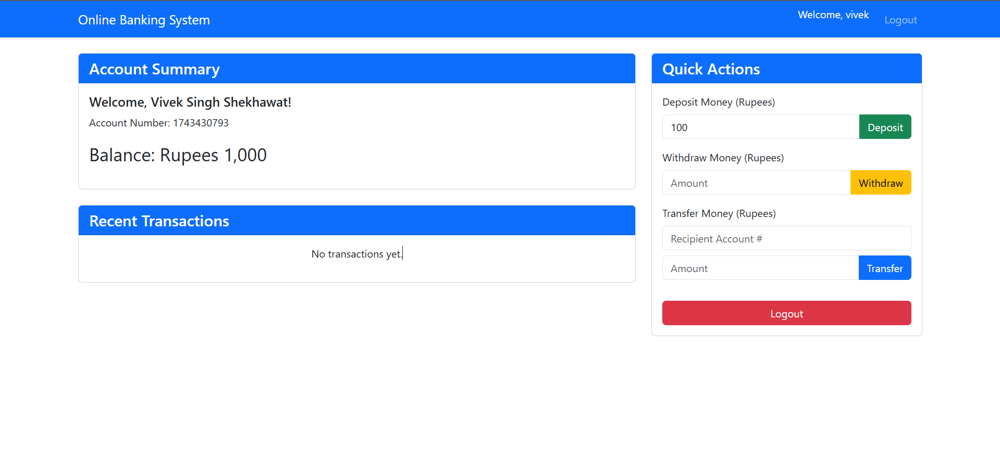
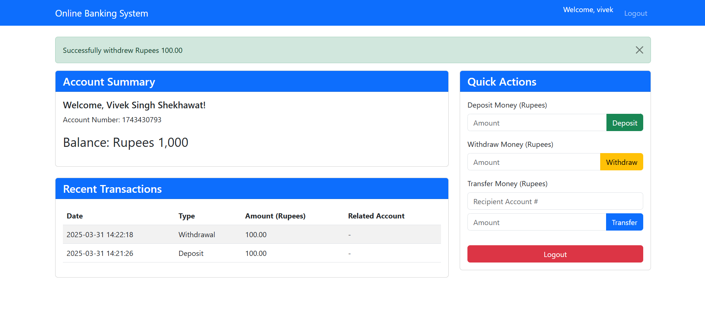
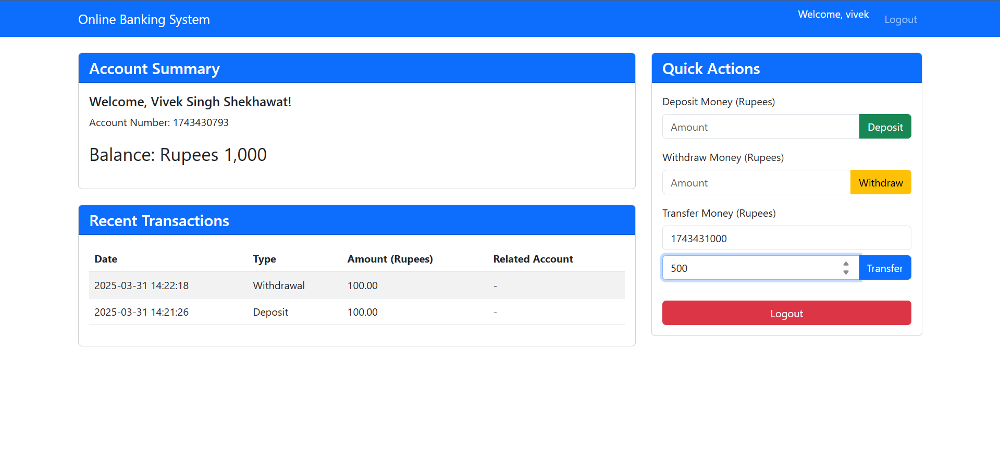
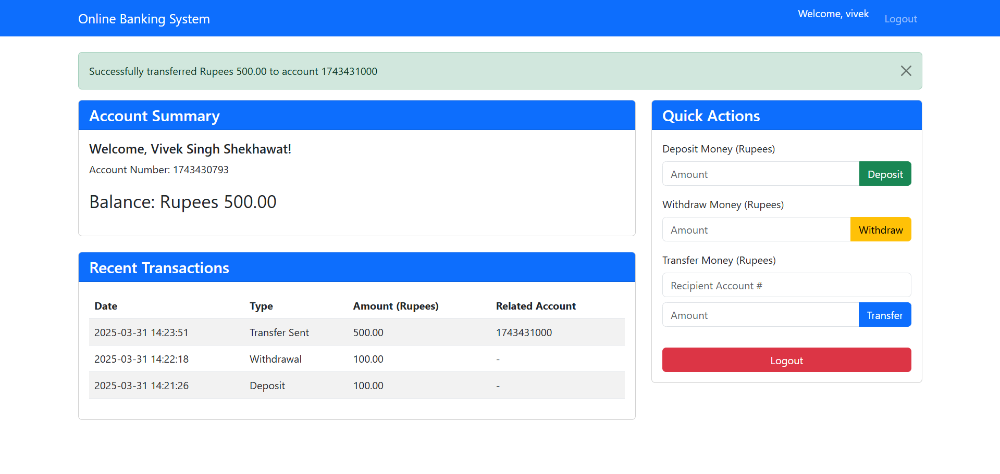
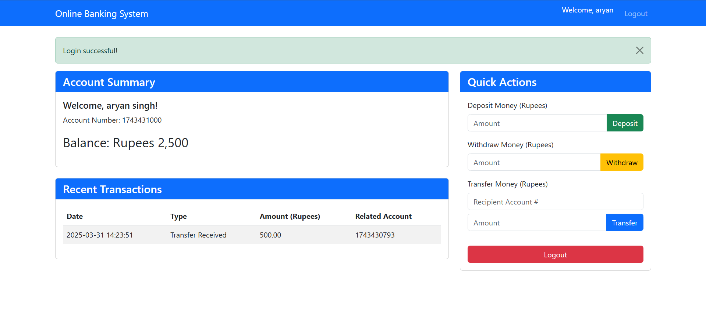
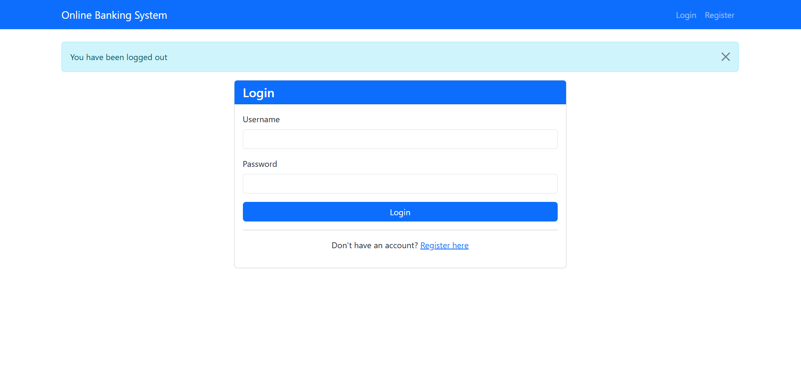

# Online-Banking-System
Online Banking System is a secure web application in Python Flask and SQLite database, with API and CLI interfaces that simulates core banking operations.

## Features
### 💰 Account Management
- User registration with initial deposit
- Secure login/logout  
- Account dashboard with balance overview
- Account deletion option

### 🔐 Transaction System
- Deposit funds
- Withdraw funds
- Transfer money between accounts
- Transaction validation (positive amounts, sufficient funds)

### 📊 Transaction History
- View recent transactions
- Detailed transfer records
- Transaction timestamps

### 🛡️ Security Features
- Password hashing (SHA-256)
- Session-based authentication
- JWT token authentication for API
- Rate limiting protection
- Input validation
- Transaction rollback for failed transfers

## Technology Stack
- Backend: Python Flask
- Database: SQLite
- Authentication: Session-based (web), JWT tokens (API)
- Frontend: HTML5, Bootstrap 5
- Security: SHA-256 hashing, Flask sessions, Rollback protection

## Middleware
The API implementation uses several middleware components:
- Authentication Middleware: Secures all transaction endpoints
- Rate Limiting Middleware: Prevents abuse by limiting request frequency
- Error-handling Middleware: Provides structured API responses

## Installation

### Prerequisites
- Python 3.8+
- pip package manager

### Web Application Setup
1. Clone the repository:
git clone https://github.com/yourusername/Online-Banking-System.git
cd Online-Banking-System

2. Create and activate a virtual environment (recommended):
python -m venv venv
source venv/bin/activate  # On Windows use venv\Scripts\activate

3. Install dependencies:
pip install flask pyjwt

4. Initialize the database and run the application:
python app.py

5. Access the application at:
http://localhost:5000

## CLI Interface
The application also offers a command-line interface that can be used independently:
python Online-Banking-System.py

This interface provides access to all core banking features through a text menu.

## Default Test Account
For quick testing of the web interface, use these credentials:
- Username: test
- Password: test123
- Account Number: 1234567890
- Initial Balance: ₹10,000.00

## Project Structure
simple-bank-flask/
├── app.py                # Main Flask web application
├── Online-Banking-System.py  # Command-line interface
├── bank.db               # SQLite database (created after first run)
├── templates/            # Flask templates
│   ├── base.html         # Base template with navigation
│   ├── login.html        # Login page
│   ├── register.html     # Registration page
│   └── dashboard.html    # Account dashboard
└── README.md             # This file

## API Endpoints

| Endpoint   | Method   | Description                       |
|------------|----------|-----------------------------------|
| /          | GET      | Homepage (redirects to login/dashboard) |
| /login     | GET/POST | User authentication               |
| /register  | GET/POST | New user registration             |
| /dashboard | GET      | Account dashboard                 |
| /deposit   | POST     | Deposit funds                     |
| /withdraw  | POST     | Withdraw funds                    |
| /transfer  | POST     | Transfer funds                    |
| /logout    | GET      | Logout user                       |

## Custom Features

### Indian Currency Formatting
The application includes a custom Jinja2 filter for Indian number formatting:

@app.template_filter('indian_format')
def indian_number_format(value):
    # Formats numbers with Indian comma separators (e.g., 1,00,000 instead of 100,000)
    value = float(value)
    if value < 1000:
        return "{:,.2f}".format(value)
    else:
        value = str(value).split('.')[0]
        last_three = value[-3:]
        other_numbers = value[:-3]
        if other_numbers:
            formatted = other_numbers[::-1].replace('', ',')[1:-1][::-1] + ',' + last_three
        else:
            formatted = last_three
        return formatted

### Rate Limiting
The CLI interface implements rate limiting to prevent abuse:

def rate_limiter(func):
    @wraps(func)
    def wrapper(self, *args, **kwargs):
        if not hasattr(self, 'current_user'):
            account_number = "anonymous"
        else:
            account_number = self.current_user['account_number']

        current_time = time.time()
        if account_number in rate_limit_cache and current_time - rate_limit_cache[account_number] < 2:
            print("Too many requests. Please wait.")
            return
        rate_limit_cache[account_number] = current_time
        return func(self, *args, **kwargs)
    return wrapper

## Security Considerations
- Passwords are hashed using SHA-256
- Session management with secret key
- JWT token authentication for API access
- Input validation for all transactions
- CSRF protection recommended for production
- Transaction rollback for failed transfers

## Screenshots

### 1. Registration

### 2. Registration Successfully

### 3. Login

### 4. Dashboard

### 5. Deposit Action

### 6. Deposit Action Successfully

### 7. Withdraw Action

### 8. Withdraw Action Successfully

### 9. Transfer Action

### 10. Transfer Action Successfully

### 11. Receiver Account

### 12. Logout Successfully

